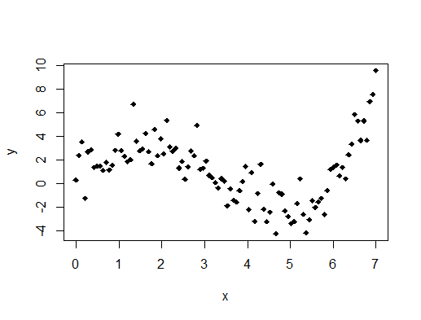
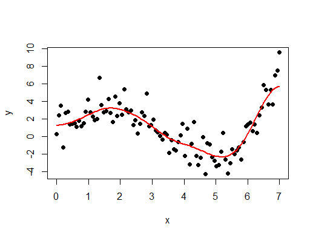

Description
-----------

This package may be used to create models via the kernel ridge
regression smoothing method. While it is a neat smoothing method, it is
not often used for two reasons:

1.  Its computation involves inverting an *n* × *n* matrix, and thus
    suffers badly from computing inefficiency.
2.  It tends to fare pretty poorly as a predictive model.

If you are still interesting in using this package, by all means, keep
reading!

Example Use of *krr*
--------------------

Let us simulate some data:
```r
  set.seed(1234)
  n <- 100
  x <- seq(0, 7, length.out = n)
  y <- 2 + x * sin(x) + rnorm(n, 0, sqrt(2))
  plot(x, y, pch = 18)
```


While kernel ridge regression can handle an *n* × *p* design frame
**X**, my example is only *n* × 1 in order to illustrate the model's
narrow usage through plotting.

### Producing a Model

Currently, objects of type `formula` are not accepted. The parameter
`lambda` is mandatory, but `sigma` defaults to 1. `sigma` is the
standard deviation parameter for the Gaussian kernel. Currently, the
Gaussian kernel is the only kernel supported. (In my experience, it's
the best anyway).
```r
mod <- krr(x, y, lambda = 1, sigma = 1)
```
Several objects are returned from the `krr` function:
```r
names(mod)

## [1] "pred"      "alpha_hat" "lambda"    "ker"       "x"         "residuals"
## [7] "MSE"
```
-   `pred` Are the model predictions.
-   `alpha_hat` Is the estimated vector alpha used to produce estimates.
-   `lambda` Is the input *λ* parameter.
-   `ker` Is the used kernel function.
-   `x` Is the input design matrix **X**.
-   `residuals` Are the model residuals.
-   `MSE` is the model mean squared error.

### Model Prediction

Notice that I provide a class type `krr`:
```r
class(mod)

## [1] "krr"
```
I also produce some S3 class methods. Specifically, a `predict.krr`
method:
```r
n_new <- 20
x_new <- seq(2, 5, length.out = n_new)
pred_x <- predict(mod, xnew = x_new)
```
Which, given only `xnew`, produces only the model predictions:
```r
head(pred_x)

##          [,1]
## [1,] 3.077697
## [2,] 2.899002
## [3,] 2.667836
## [4,] 2.388769
## [5,] 2.062070
## [6,] 1.689195
```
However, if given a `ynew` parameter, an MSE is also produced:
```r
y_new <- 2 + x_new * sin(x_new) + rnorm(n_new, 0, sqrt(2))
pred_y <- predict(mod, xnew = x_new, ynew = y_new)
names(pred_y)

## [1] "pred" "MSE"

head(pred_y$pred)

##          [,1]
## [1,] 3.077697
## [2,] 2.899002
## [3,] 2.667836
## [4,] 2.388769
## [5,] 2.062070
## [6,] 1.689195

pred_y$MSE

## [1] 1.156105
```
### Plot

I also provide a `plot.krr` function, which only works when *p* = 1:
```r
plot(mod)
```


### Model Selection

Selecting an appropriate *λ* is not easy. If we allow *λ* to be too
small, we have a near-perfect fit. If *λ* is too large, our model hardly
fits at all. I provide a function to aide in model fitting. However, due
to matrix inversion, this function may take a long time for large *n*.
```r
cv <- cv_krr(x, y, lambda_index = seq(0.05, 0.15, 0.01))
names(cv)

## [1] "lambda_best" "MSE_best"    "index"       "model_best"
```
This function uses a crude mockery of cross-validation. The parameter
`lambda_index` is a vector of *λ*s upon which to run the model.
```r
# Which lambda produced the lowest MSE?
cv$lambda_best

## [1] 0.13

# Which MSE (corresponding to lambda_index) was lowest?
cv$MSE_best

## [1] 1.581844

# A data.frame of all lambda_index values and corresponding MSEs.
cv$index

##    lambda_index      MSE
## 1          0.05 2.779005
## 2          0.06 2.741878
## 3          0.07 2.715519
## 4          0.08 2.696765
## 5          0.09 2.683606
## 6          0.10 2.674692
## 7          0.11 2.669078
## 8          0.12 2.666084
## 9          0.13 2.665203
## 10         0.14 2.666052
## 11         0.15 2.668332
```
The object `cv$model_best` is an object of type `krr` produced using
`cv$lambda_best`.

### Conclusion

And that's it! I have a few `TODO`s in this package, but I don't know if
I'll ever get to them, since I anticipate no high demand for these
methods. If you have any requests or suggestions for
refactoring/improving my code (would be much appreciated!), please email
me at <TimothyKBook@gmail.com>.
